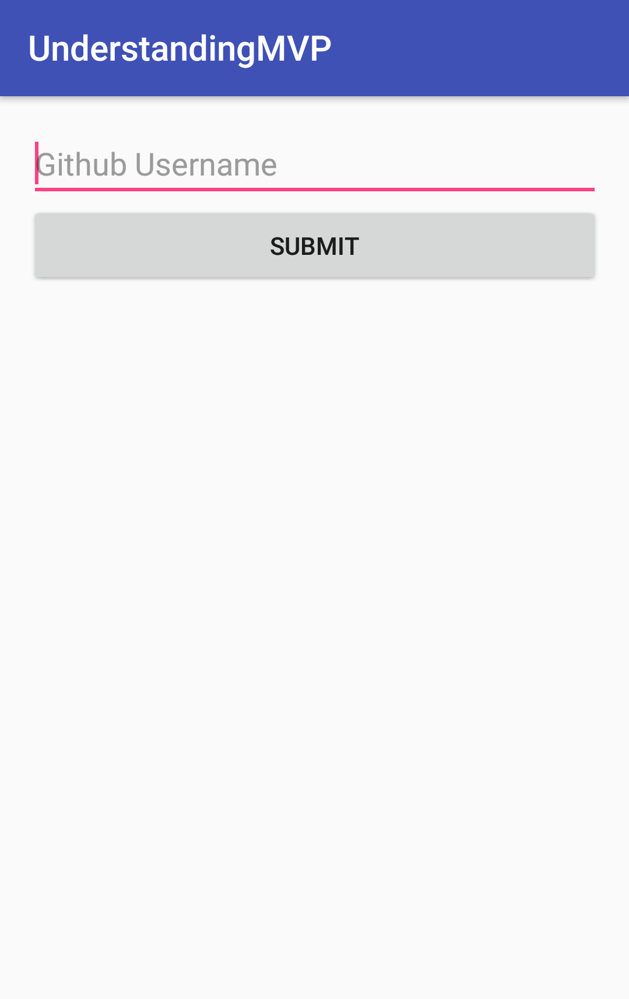
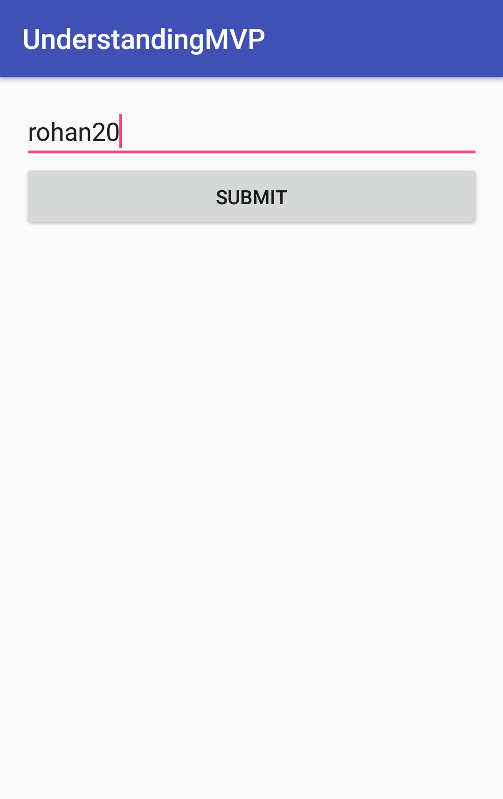
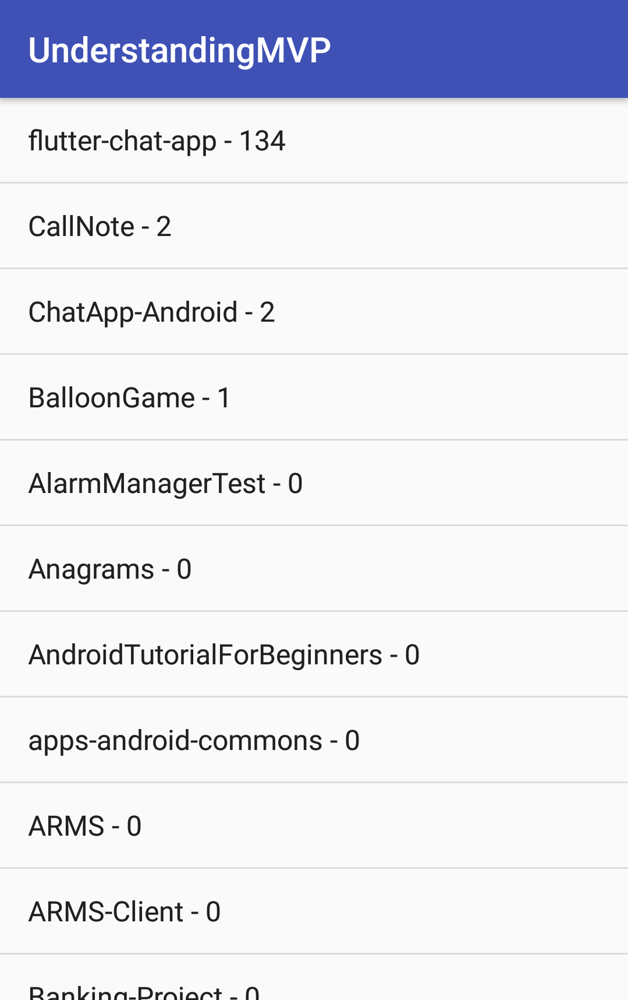
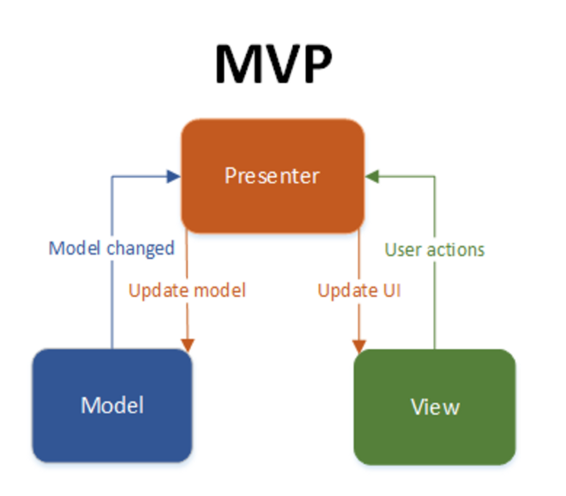

# Android - Model View Presenter (MVP)
### Show some :heart: and star the repo to support the project
[](https://github.com/YashishDua/AndroidMVP) [](https://github.com/yashishdua/AndroidMVP/fork) [](https://github.com/yashishdua/AndroidMVP)

### Screenshots (Just to know what is the flow of application) 

  

### What is MVP?
MVP stands for Model View Presenter and is one of the most widely used architecture while developing android applications.
MVP design pattern is a set of guidelines that help to create a testable and structural code. It divides the application components based on its role, called separation of concern.

This architecture creates three layers:

+ Model
+ View
+ Controller

Model is your database or data provider, View is the user interface, and Controller mediates View access to Model nad vice-versa.



+ ### View Interface ( Implemented by First Activity | ScreenShot 1 )
```Java
public interface ILoginView {
    void loginSuccess(String username);
    void loginFailed();
}
```

+ ### Presenter Layer ( Of First Activtiy in this repository | ScreenShot 1 )
```Java
public class LoginPresenter {
    private ILoginView view;

    public LoginPresenter(ILoginView view) {
        this.view = view;
    }

    public void attemptLogin(String username){
        if(username.contains(" ") || username.trim().compareTo("") == 0)
            view.loginFailed();
        else view.loginSuccess(username);
    }
}
```

+ ### First Activity using LoginPresenter and implementing ILoginView
```Java
public class MainActivity extends AppCompatActivity implements ILoginView {

    @BindView(R.id.edit_text_username) EditText editTextUseranme;

    LoginPresenter loginPresenter;

    @Override
    protected void onCreate(Bundle savedInstanceState) {
        super.onCreate(savedInstanceState);
        setContentView(R.layout.activity_main);
        ButterKnife.bind(this);

        loginPresenter = new LoginPresenter(this);
    }

    @OnClick(R.id.button_submit)
    void submitCredentials(){
        String username = editTextUseranme.getText().toString();
        loginPresenter.attemptLogin(username);
    }

    @Override
    public void loginSuccess(String username) {
        startActivity(new Intent(this,RepoListActivity.class).putExtra("Username",username));
    }

    @Override
    public void loginFailed() {
        Toast.makeText(this,"Login Failed!",Toast.LENGTH_LONG).show();
    }
}
```


<strong> Note: I will keep updating this repository with new android architecture resources. Also, if you wish to contribute to this repository, create issue and let's get started. </strong>

### Created & Maintained By
[Yashish Dua](https://github.com/yashishdua) 
([@duayashish](https://www.twitter.com/@duayashish))


### My Work
+ [SolveWithStack](https://github.com/YashishDua/SolveWithStack)
Android library for helping you to reach out to best possible answer for your bug/error available on stack overflow and will show it in your Android Studio Console only.

### License
=======

    Copyright 2017 Yashish Dua

    Licensed under the Apache License, Version 2.0 (the "License");
    you may not use this file except in compliance with the License.
    You may obtain a copy of the License at

       http://www.apache.org/licenses/LICENSE-2.0

    Unless required by applicable law or agreed to in writing, software
    distributed under the License is distributed on an "AS IS" BASIS,
    WITHOUT WARRANTIES OR CONDITIONS OF ANY KIND, either express or implied.
    See the License for the specific language governing permissions and
    limitations under the License.
